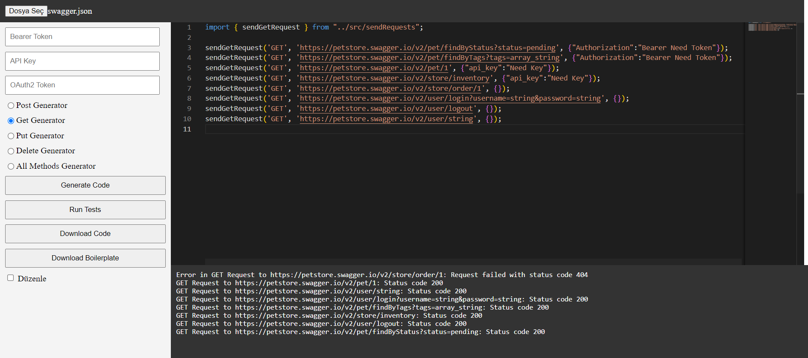

# Swagger Test Generator

## Technology Contents Used:

1. Nodejs
2. TypeScript
3. Axios
4. Swagger Parser
5. Faker
6. Vue.js
7. Express
8. Multer
9. CORS
10. Monaco Editör
11. JSZip

## Getting started:

Go to the backend directory and start the backend service with the `npx ts-node index.js` command. Go to the frontend directory and start the frontend with the `npm run serve` command.

### Project View

### Project Working Logic

After installing the backend and frontend, you can upload the Swagger document you want and create test code for any method you want or for all of them. You can run the test codes you created and see the results in the texbox below.

The Download Code button allows you to download the codes in the IDE-looking textbox as '_.ts_' file. The Download Boilerplate button downloads the necessary codes in zip format so that the test codes can run simply. After downloading the boilerplate.zip file, extract the files in a folder and open the project via any IDE.

After opening the project, download the necessary dependencies defined in the package.json file with the `npm i` command, and then you can run the test codes with the `npm start` command. You can see the test results from the IDE terminal. Month

You can also use test generation methods alone. Compile and run the trial.ts file to see how it can be used. (Update the swaggerFilePath parameter according to your needs.)

**Don't forget to use the word \_await\_ when calling.**
